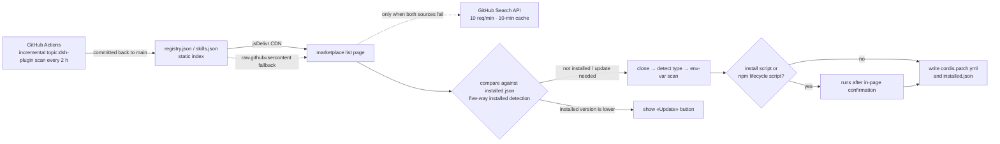

# DSH Plugin Marketplace (dsh-plugin-marketplace)

[中文](README.md) · English

A plugin marketplace for [DeepSeek Harness](https://github.com/deepseek-ai/deepseek-harness) (DSH): it indexes every repository under the GitHub `dsh-plugin` topic and presents them as cards in the DSH Web GUI settings page — one-click install, version detection, and auto-update, no command line required.

<p align="center">
  
  
  
  
</p>

<p align="center">
  <b>9500+</b> DSH plugins &nbsp;·&nbsp; <b>20000+</b> general Skills &nbsp;·&nbsp; <b>2 h</b> incremental ingestion &nbsp;·&nbsp; <b>0</b> GitHub API calls on the browsing side
</p>

<!-- TOC -->
- [Install](#install)
- [What you do in the settings page](#what-you-do-in-the-settings-page)
- [Versus searching GitHub yourself](#versus-searching-github-yourself)
- [How plugin authors get listed](#how-plugin-authors-get-listed)
- [Known limitations and disclaimer](#known-limitations-and-disclaimer)
<!-- /TOC -->

## Install

Official CLI (recommended — installed and registered by Harness's own mechanism):

```bash
dsh plugin --profile web install bradeGithub/DSH-Plugins-Marketplace
```

Uninstall / update:

```bash
dsh plugin --profile web remove bradeGithub/DSH-Plugins-Marketplace
dsh plugin --profile web install bradeGithub/DSH-Plugins-Marketplace   # reinstall = update
```

Without the `dsh` CLI, use the install script (it automatically defers to the CLI when detected):

| Platform | Command |
|---|---|
| Windows (PowerShell) | `irm https://raw.githubusercontent.com/bradeGithub/DSH-Plugins-Marketplace/main/install.ps1 \| iex` |
| macOS / Linux | `curl -sL https://raw.githubusercontent.com/bradeGithub/DSH-Plugins-Marketplace/main/install.sh \| bash` |

> [!WARNING]
> The install script downloads and executes code from this repository — trust-to-execute; review the script before running it. The official CLI path runs no third-party scripts. The plugin registers itself into `~/.dsh/profiles/web/cordis.patch.yml` and loads with every DSH start; after installing, **restart DSH** (re-run `dsh web`) and refresh the page.

<details>
<summary>Manual install / hand to an AI</summary>

Manually: clone this repository to `~/.dsh/profiles/web/node_modules/dsh-plugin-marketplace` and register it in `~/.dsh/profiles/web/cordis.patch.yml`:

```yaml
- insert:
    - id: dsh-plugin-marketplace
      name: dsh-plugin-marketplace
```

One sentence to hand to an AI (any AI with command execution works):

> Install the DSH plugin marketplace (dsh-plugin-marketplace): run `dsh plugin --profile web install bradeGithub/DSH-Plugins-Marketplace`; if there is no dsh CLI, clone https://github.com/bradeGithub/DSH-Plugins-Marketplace into ~/.dsh/profiles/web/node_modules/dsh-plugin-marketplace and register it in ~/.dsh/profiles/web/cordis.patch.yml (id: plugin-marketplace, name: dsh-plugin-marketplace), then restart dsh web.

</details>

## What you do in the settings page

1. Restart DSH, open the Web GUI, and go to **Settings → DSH Plugin Marketplace**.
2. The list loads automatically (installed first, the rest by stars); the search box filters by name, category chips filter by column.
3. Card buttons: **Install** (live-scrolling log) — if `API_KEY`-style material is required a dialog asks for it (submit or skip); **Update** (appears when a newer version is detected); **Installed** (greyed out, nothing to do).
4. Switch to the **General Skills** tab to browse 20000+ skills with search, pagination, and one-click install.

## Versus searching GitHub yourself

| Capability | This marketplace | Manual search & clone |
|---|---|---|
| Distribution | CI-built static index served via the jsDelivr CDN — zero GitHub API usage on the browsing side; falls back to the search API (10 req/min unauthenticated) only when the index is unreachable | Every browse and page-turn spends unauthenticated API quota |
| Ingestion | CI scans the `dsh-plugin` topic every 2 hours and merges results into the index | Depends on awesome lists or keyword searches — coverage is luck |
| Type adaptation | Auto-detects cordis plugin / SKILL.md / agent preset / install script, then installs dependencies and registers entries | You identify the plugin type, install deps, and write registration entries by hand |
| Risk confirmation | Third-party install scripts and npm lifecycle scripts ask for confirmation first; material is passed as env vars only and never persisted | You execute scripts from unknown repos directly |
| Version awareness | Installed version is compared against the index automatically; the button shows «installed vX → vY» | You track upstream releases and re-clone manually |

## How plugin authors get listed

Tag your repository with the `dsh-plugin` topic — CI merges it into the index within 2 hours, no application or issue needed. Type-detection rules, install shapes, and common anti-patterns: [STANDARD.en.md](STANDARD.en.md) ([中文](STANDARD.md)).

<details>
<summary>How it works (data source and install pipeline)</summary>



- The index contains repo metadata only (name / description / stars / updated_at / topics / license); installs still clone directly from `github.com`.
- Five-way installed detection: install manifest → directory heuristics → package-name mapping (incl. `pkg_name` and scoped packages) → bidirectional `repository` check → self-identification; `@deepseek-ai/*` official plugins are auto-excluded.
- Marketplace self-update only accepts maintainer SSH-signed release tags (local verification + tag↔version↔commit SHA binding; unverifiable updates fail closed).

</details>

<details>
<summary>Local storage layout and HTTP API</summary>

```
~/.dsh/
├── profiles/web/
│   ├── node_modules/dsh-plugin-marketplace/   ← the plugin itself
│   └── cordis.patch.yml                       ← registration entry
└── marketplace/
    ├── cache/<owner>__<name>/                 ← clone cache (install & version data source)
    └── installed.json                         ← install manifest
```

| Endpoint | Method | Description |
|---|---|---|
| `/api/marketplace/list` | GET | plugin list (with installed / version state); `?refresh=1` forces a re-fetch |
| `/api/marketplace/skills` | GET | general skills list |
| `/api/marketplace/install` | POST | `{repo, answers}` → `done` / `awaiting-input` / `aborted` / `failed` / `manual` |
| `/api/marketplace/uninstall` | POST | `{repo}` full uninstall (registration entry and install record included) |
| `/api/marketplace/self-update` | GET / POST | self version check / signature-channel self-update |
| `/api/marketplace/check-update` | POST | manual version check for npm-type plugins |
| `/api/marketplace/feedback` | POST | install feedback, sanitized and synced to a GitHub issue |
| `/api/marketplace/env-keys` / `env-edit` | GET / POST | read env-var keys / write values for installed plugins |
| `/api/marketplace/backup` · `restore/diff` · `backup/webdav` · `restore/webdav` | GET / POST | backup export / restore diff / WebDAV push & pull |
| `/api/marketplace/logs` | GET | sanitized install-log export |

All write operations share one auth model: loopback requests pass directly; LAN requests require `lanWrite: true` plus the `x-dsh-marketplace-token` session header. Uninstall relies on the `installed.json` record — only plugins **installed via this marketplace** can be fully uninstalled. Full field reference: [docs/README.md](docs/README.md).

</details>

## Known limitations and disclaimer

- The install endpoint has no user authentication; protection is a loopback / LAN Host allowlist plus a CSRF header and Origin check — do not expose the DSH web port to untrusted networks.
- An install is a single long-lived POST (clone + build + material-confirmation rounds); a short-timeout reverse proxy may cut the connection — the backend keeps running, refresh the page to confirm the result.
- Version detection only applies to cordis plugins with a `package.json`; skills / presets / script types have no version concept.
- «Installed» detection for script-type plugins relies on the cache directory; deleting the cache makes them installable again.
- Every plugin in the marketplace comes from a third-party repository and is not affiliated with DSH or this marketplace; listing is not a recommendation or endorsement. The marketplace is provided AS-IS with no warranty on plugin quality, security, or compatibility — evaluate each repository yourself before installing.

<details>
<summary>Ecosystem and acknowledgements</summary>

[Harness Desktop](https://github.com/baiyuscc13724-max/deepseek-harness-desktop): a third-party, community-maintained Windows desktop app whose stable release bundles this marketplace; [awesome-dsh-plugin](https://github.com/awesome-dsh-plugin/awesome-dsh-plugin): the community-curated list that powers the «community listed» badge, cross-linked with this marketplace. Neither is affiliated with DeepSeek.

Code contributors: [lgnorant-lu](https://github.com/lgnorant-lu) (endpoint auth, security hardening, testing system), [baiyuscc13724-max](https://github.com/baiyuscc13724-max) (desktop integration), [anupamme](https://github.com/anupamme) (SSRF allowlist hardening), and others; ecosystem collaborators: [qing3a](https://github.com/qing3a) (dsh-plugin-verify), [wwumit](https://github.com/wwumit) (skills-catalog), [ylwl1997](https://github.com/ylwl1997) (dshbase).

</details>

Development and contribution: [docs/DEVELOPMENT.md](docs/DEVELOPMENT.md) and [docs/](docs/README.md); version history: [docs/CHANGELOG.md](docs/CHANGELOG.md). License: MIT.
