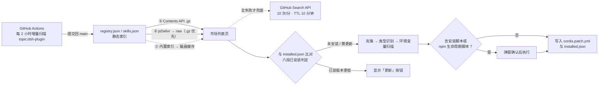

# DSH 插件市场（dsh-plugin-marketplace）

中文 · [English](README.en.md)

为 [DeepSeek Harness](https://github.com/deepseek-ai/deepseek-harness)（DSH）打造的插件市场插件：自动索引 GitHub `dsh-plugin` topic 下的全部插件，在 DSH Web GUI 设置页以卡片展示，支持一键安装、版本检测与自动更新，无需命令行。

<p align="center">
  
  
  
  
</p>

<p align="center">
  <b>9500+</b> DSH 插件 &nbsp;·&nbsp; <b>20000+</b> 通用 Skills &nbsp;·&nbsp; <b>2 小时</b> 增量收录 &nbsp;·&nbsp; 浏览侧 <b>0</b> 次 GitHub API 调用
</p>

<!-- TOC -->
- [安装](#安装)
- [在设置页里做什么](#在设置页里做什么)
- [和自己搜 GitHub 差在哪](#和自己搜-github-差在哪)
- [插件作者如何被收录](#插件作者如何被收录)
- [已知限制与免责声明](#已知限制与免责声明)
<!-- /TOC -->

## 安装

官方 CLI（推荐，由 Harness 官方机制安装并注册）：

```bash
dsh plugin --profile web install bradeGithub/DSH-Plugins-Marketplace
```

卸载 / 更新：

```bash
dsh plugin --profile web remove bradeGithub/DSH-Plugins-Marketplace
dsh plugin --profile web install bradeGithub/DSH-Plugins-Marketplace   # 重装即更新
```

无 `dsh` CLI 的环境用安装脚本（脚本检测到 CLI 时会自动转用官方方式）：

| 平台 | 命令 |
|---|---|
| Windows (PowerShell) | `irm https://raw.githubusercontent.com/bradeGithub/DSH-Plugins-Marketplace/main/install.ps1 \| iex` |
| macOS / Linux | `curl -sL https://raw.githubusercontent.com/bradeGithub/DSH-Plugins-Marketplace/main/install.sh \| bash` |

> [!WARNING]
> 安装脚本会从本仓库下载并执行代码，属「信任即执行」——建议先肉眼检查脚本再执行；官方 CLI 方式不运行第三方脚本。插件安装后注册进 `~/.dsh/profiles/web/cordis.patch.yml` 并随 DSH 启动加载；安装完成后需**重启 DSH**（重跑 `dsh web`）再刷新页面。

<details>
<summary>手动安装 / 交给 AI 执行</summary>

手动：克隆本仓库到 `~/.dsh/profiles/web/node_modules/dsh-plugin-marketplace`，并在 `~/.dsh/profiles/web/cordis.patch.yml` 注册：

```yaml
- insert:
    - id: dsh-plugin-marketplace
      name: dsh-plugin-marketplace
```

交给 AI 的一句话（具备命令执行能力即可）：

> 安装 DSH 插件市场插件（dsh-plugin-marketplace）：运行 `dsh plugin --profile web install bradeGithub/DSH-Plugins-Marketplace`；若没有 dsh CLI，则克隆 https://github.com/bradeGithub/DSH-Plugins-Marketplace 到 ~/.dsh/profiles/web/node_modules/dsh-plugin-marketplace，在 ~/.dsh/profiles/web/cordis.patch.yml 中注册（id: plugin-marketplace，name: dsh-plugin-marketplace）。完成后重启 dsh web。

</details>

## 在设置页里做什么

1. 重启 DSH 后打开 Web GUI，进入 **设置 → DSH 插件市场**。
2. 列表自动加载（已安装置顶，其余按 Star 排序）；搜索框按名称过滤，分类 chips 按栏目筛选。
3. 卡片按钮：**安装**（实时日志滚动）——需要 `API_KEY` 等材料时弹窗索取，可提交或跳过；**更新**（检测到新版本时出现）；**已安装**（灰色锁定，无需操作）。
4. 切到 **通用 Skills** tab 浏览 20000+ 技能，支持搜索、分页加载与一键安装。

## 和自己搜 GitHub 差在哪

| 能力 | 本市场 | 手动搜索与克隆 |
|---|---|---|
| 分发 | 静态索引（CI 生成）多级降级分发：Contents API → jsDelivr → raw → 内置索引 → 磁盘缓存；10 分钟 TTL 内零请求，全失败才回退搜索 API（未认证 10 次/分） | 每次浏览翻页都消耗未认证 API 配额 |
| 收录 | CI 每 2 小时增量扫描 `dsh-plugin` topic 并合并进索引 | 依赖 awesome 列表或关键词搜索，覆盖靠运气 |
| 类型适配 | 自动识别 cordis 插件 / SKILL.md / agent 预设 / 安装脚本四型，并完成依赖安装与注册 | 手动判断插件类型、装依赖、写注册条目 |
| 风险确认 | 第三方安装脚本与 npm 生命周期脚本执行前弹窗确认；安装材料仅作环境变量传入、不落盘 | 本地直接执行陌生仓库脚本 |
| 版本感知 | 已装版本与索引版本自动比对，不一致时按钮提示「已装 vX → vY」 | 手动跟踪上游 Release 后重新克隆覆写 |

## 插件作者如何被收录

给仓库打上 `dsh-plugin` topic 即可——CI 最迟 2 小时将其收进索引，无需申请或提 issue。类型判定规则、安装形态与常见反模式见 [STANDARD.md](STANDARD.md)（[English](STANDARD.en.md)）。

<details>
<summary>工作原理（数据源与安装管线）</summary>



- 索引只含仓库元数据（名称 / 描述 / Star / 更新时间 / 标签 / 许可）；安装仍直连 `github.com` 克隆。
- 已安装判定六段管线：安装清单 → 托管目录启发式（`dirOwners`）→ 本体识别 → profile 映射命中（slug/仓库名/`pkg_name` 与 `repository` 双向校验）→ 脚本缓存 → 缓存包名映射再回查 profile；`@deepseek-ai/*` 官方插件自动排除。
- 市场本体自更新仅采纳维护者 SSH 签名的 release tag（本地验签 + tag↔版本↔commit SHA 绑定，验不过 fail-closed 拒更）。

分层架构、索引构建算法、版本检测来源表与判定细节见 [docs/ARCHITECTURE.md](docs/ARCHITECTURE.md)；安全模型见 [docs/SECURITY.md](docs/SECURITY.md)。

</details>

<details>
<summary>本地存储结构与 HTTP 接口</summary>

```
~/.dsh/
├── profiles/web/
│   ├── node_modules/dsh-plugin-marketplace/   ← 插件本体
│   └── cordis.patch.yml                       ← 注册条目
└── marketplace/
    ├── cache/<owner>__<name>/                 ← 克隆缓存（安装与版本比对数据源）
    └── installed.json                         ← 已安装清单
```

| 接口 | 方法 | 说明 |
|---|---|---|
| `/api/marketplace/list` | GET | 插件列表（含已安装 / 版本状态）；`?refresh=1` 强制重拉 |
| `/api/marketplace/skills` | GET | 通用 Skills 列表 |
| `/api/marketplace/install` | POST | `{repo, answers}` → `done` / `awaiting-input` / `aborted` / `failed` / `manual` |
| `/api/marketplace/uninstall` | POST | `{repo}` 完整卸载（含注册条目与安装记录） |
| `/api/marketplace/self-update` | GET / POST | 本体版本检测 / 签名通道自更新 |
| `/api/marketplace/check-update` | POST | npm 型插件手动版本检测 |
| `/api/marketplace/feedback` | POST | 安装反馈，脱敏后同步 GitHub issue |
| `/api/marketplace/env-keys` / `env-edit` | GET / POST | 插件环境变量键名查询 / 写入 |
| `/api/marketplace/backup` · `restore/diff` · `backup/webdav` · `restore/webdav` | GET / POST | 备份导出 / 恢复差异 / WebDAV 推拉 |
| `/api/marketplace/logs` | GET | 脱敏安装日志导出 |

写操作鉴权一致：回环请求直接放行；LAN 请求需 `lanWrite: true` 配置 + `x-dsh-marketplace-token` 会话头。卸载依赖 `installed.json` 记录——仅「通过本市场安装」的插件可完整卸载。完整接口契约（body 字段 / 返回值 / 状态机）见 [docs/HTTP-API.md](docs/HTTP-API.md)。

</details>

## 已知限制与免责声明

- 安装端点无用户认证，防护为「回环 / LAN Host 白名单 + CSRF 头 + Origin 校验」——不要把 DSH web 端口暴露到不可信网络。
- 安装任务是单个长 POST（克隆 + 构建 + 材料确认多轮），短超时反向代理可能切断连接——后端仍继续执行，刷新页面确认结果。
- 版本检测仅对含 `package.json` 的 cordis 插件生效；skill / 预设 / 脚本类无版本概念。
- 脚本类插件的「已安装」判定基于缓存目录存在性，删除缓存后恢复可安装状态。
- 市场中的插件均来自第三方仓库，由各仓库作者独立维护，与 DSH 及本市场无关联；收录不构成推荐或背书。本市场按「现状」（AS-IS）提供，不对插件质量、安全性与兼容性作担保；因安装或使用第三方插件造成的任何直接或间接损失（含数据丢失、系统损坏、隐私泄露），本市场及开发者不承担责任——安装前请自行评估仓库可信度。完整限制清单见 [docs/USAGE.md](docs/USAGE.md) §7-8。

<details>
<summary>生态与致谢</summary>

[Harness Desktop](https://github.com/baiyuscc13724-max/deepseek-harness-desktop)：第三方维护的 Windows 桌面版，稳定版内置本市场（该条目由桌面版作者提交，其同时维护桌面端使用的市场分支）；[awesome-dsh-plugin](https://github.com/awesome-dsh-plugin/awesome-dsh-plugin)：社区精选列表，「社区收录」徽章数据源，与本市场互链收录。两者与 DeepSeek 官方均无关联。

代码贡献者：[lgnorant-lu](https://github.com/lgnorant-lu)（写端点鉴权、安全健壮性修复 PR #63、机械化测试体系 PR #66 等核心贡献）、[baiyuscc13724-max](https://github.com/baiyuscc13724-max)（Harness Desktop 集成与安装流程简化 #1/#2）、[anupamme](https://github.com/anupamme)（OrbisAI Security，verify-installability SSRF 白名单防护 #213）；any / bubble / tatakaria——早期贡献。生态协作者：[qing3a](https://github.com/qing3a)（dsh-plugin-verify，驱动「✓ 已验证」徽章）、[wwumit](https://github.com/wwumit)（skills-catalog，驱动「披露 ✓」徽章）、[ylwl1997](https://github.com/ylwl1997)（dshbase 收录互认）、awesome-dsh-plugin 维护者（互链收录 PR #994）。

感谢每一位通过市场反馈与 issue 报告问题的用户——你们的报告直接驱动修复节奏。参与贡献见 [docs/CONTRIBUTING.md](docs/CONTRIBUTING.md) 与 [STANDARD.md §7 自测清单](STANDARD.md)。

</details>

开发与贡献见 [docs/DEVELOPMENT.md](docs/DEVELOPMENT.md) 与 [docs/](docs/README.md)；版本迭代见 [docs/CHANGELOG.md](docs/CHANGELOG.md)。许可：MIT。
